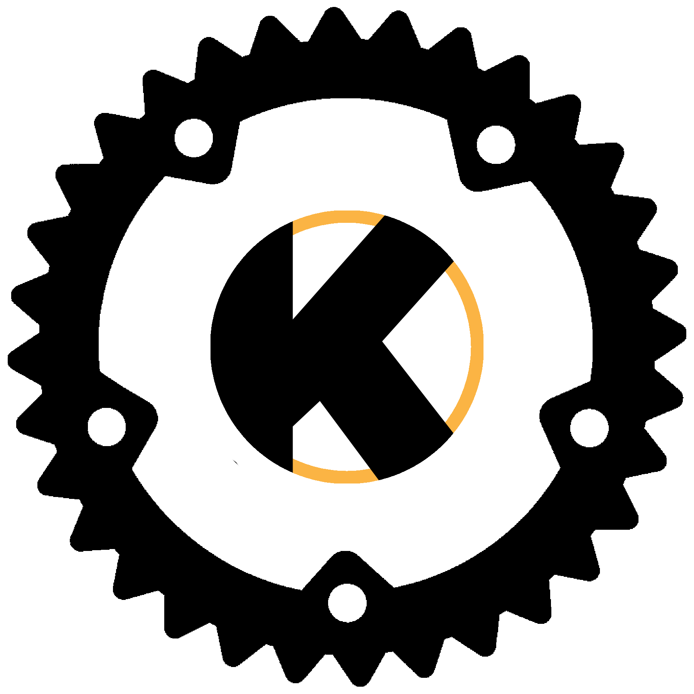

<p align="center">
  
</p>

<h1 align="center">
  <i>unCore</i>
</h1>

<p align="center">
  
  
  
</p>

#

## Introduction

**_unCore_** is an [operating system kernel][kernel::wikipedia] completely written is [Rust][rust-lang::main].  This work was and is heavily inspired by [_Phillip Oppermann_'s _BlogOS_][blog-os::github] project. The purpose of **_unCore_** is to explore Rust's capabilities, get a better understanding of how Rust and [kernels][kernel::wikipedia] work, and to provide a kernel implementation.

## Goals

This project does not explain the process of building and designing a kernel like _Phillip Oppermann_ did in his series. If you'd like to learn more about the process, [visit his website][blog-os::main].

The goals of this project are

1. **Robustness** –– Rust is known for its safety and compile time guarantees. This shall be used to provide an inherently (memory) safe implementation of a kernel.
2. **Correctness** –– This kernel implementation provides exhaustive unit and integration testing to ensure [a high degree](https://www.cs.utexas.edu/users/EWD/transcriptions/EWD03xx/EWD303.html) of correctness.
3. **Abstraction** –– Rust provides a more abstract style of writing code than for example [C][c::wikipedia]. This can lead to more beautiful solutions to certain problems.
4. **Speed** –– It's obvious that kernels are to be written in well-performing languages that satisfy [certain requirements](https://youtu.be/RyY01fRyGhM?t=385).
5. **Education** –– Anyone who is interested in the codebase will find extensive documentation. This serves the goal of providing everyone with an understanding of what the code does, why it's designed this way and how it works.

## Dependencies

We require Rust via `rustup`. All other dependencies are installed by a provided script. Take the following steps:

``` BASH
# install Rust
curl --proto '=https' --tlsv1.2 -sSf https://sh.rustup.rs | sh

# install all other dependencies
./scripts/init.sh install deps
```

## Documentation

Found in the `documentation/` directory, [_MkDocs_][mkdocs::home] is used to build the documentation. It's completely written in [Markdown][markdown::github]. All files are located under `docs/`, the configuration file is `mkdocs.yml`.

The `Makefile` provides the necessary commands to install all dependencies (with `make dependencies`). It also provides the shortcut to serve the documentation locally (with `make serve`) under [`127.0.0.1:8080`](http://127.0.0.1:8080).

## What's Next

The implementation of the "[Introduction to Paging](https://os.phil-opp.com/paging-introduction/)" section in the [_Writing an OS in Rust_][blog-os::main] series.

## Licensing

This project is licensed under the [GNU General Public License 3][license::test], **except** for those parts (lines of code and information directly taken) [already licensed under other licenses by _Phillip Oppermann_ in his _BlogOS_ project][license::phil-op-blog-os].

[license::test]: https://www.gnu.org/licenses/gpl-3.0.txt
[license::phil-op-blog-os]: https://github.com/phil-opp/blog_os#license

[//]: # (Links)

[kernel::wikipedia]: https://en.wikipedia.org/wiki/Kernel_(operating_system)
[rust-lang::main]: https://www.rust-lang.org/
[c::wikipedia]: https://en.wikipedia.org/wiki/C_(programming_language)

[blog-os::github]: https://github.com/phil-opp/blog_os
[blog-os::main]: https://os.phil-opp.com/

[mkdocs::home]: https://www.mkdocs.org/
[markdown::github]: https://github.com/adam-p/markdown-here/wiki/Markdown-Cheatsheet
